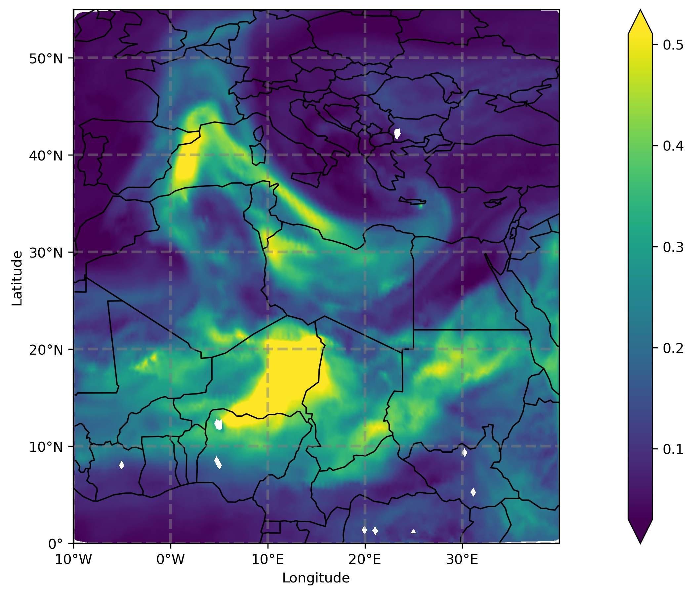

# MieAI

A neural network for calculating optical properties of internally mixed aerosols in atmospheric models ([https://arxiv.org/pdf/2312.06497.pdf](https://arxiv.org/pdf/2312.06497.pdf)).

# Paper

Look at [this link](https://arxiv.org/pdf/2312.06497.pdf) for the details about MieAI.

# Usage

Here is an example usage of MieAI for calculating aerosol optical depth (AOD):
```python
from aop import MieAI

core = ['dust', 'soot', 'na', 'cl']
shell = ['h2o', 'so4', 'nh4', 'no3']
wavelength = 0.55 # [in micrometer]
mode = 'acc' # for accumulation mode


dx = xr.open_dataset('icon-art-aging-aero_DOM01_ML_0012.nc')
mie = MieAI(dx, lam, core=core, shell=shell, mode='acc')
aod = mie.get_aod()
```

To calculate the bulk optical properties like extinction coefficient (k~e~), scattering coefficient (k~s~), single scattering albedo (SSA) and asymmetry parameter (g) at all vertical levels:

```python
aop = mie.get_aop(dx)
```


# Analysis codes

1. [Mie calculation for core-shell configuration](Mie_calculation.ipynb)
2. [Compilation of Mie results in a single file](read_mie_data_10m.ipynb)
3. [MLP training without quantile transform: x1](mlp_training_double_x1_10m.ipynb)
4. [MLP training without quantile transform: x2](mlp_training_double_x2_10m.ipynb)

5. [Quantile Transformation: Figure3 in paper](quantile_transform.ipynb)

6. [Hyperparamter optimisation of MLP architecture: Part1](mlp_hyper1.ipynb)
7. [Hyperparamter optimisation of MLP architecture: Part2](mlp_hyper2.ipynb)
8. [Hyperparamter optimisation Table](read_hyper.ipynb)

9. [MieAI Training](MieAI_training.ipynb)
10. [MieAI performance: Figure4 in paper](MieAI_performance.ipynb)
11. [AOD calculation using MieAI](AOD.ipynb)

# utility codes

1. [Codes translated from MATLAB2python](mei.py)
2. [Functions for preprocessing, mie run and MLP](mie_icon_art.py)
3. [AOD calculation using ICON-ART data](aop.py)


# Use cases
1. [Code for Biomass Burning Event](wildfire.ipynb)
2. [Code for Volcanic Eruption Event](volcano.ipynb)
3. [Code for Dust Event](dust.ipynb)
4. [Code for Volcanic Eruption Event using the MLP without quantile transform](volcano_old.ipynb)


# References

1. [Papers](paper.md)
2. [Packages](software.md)


